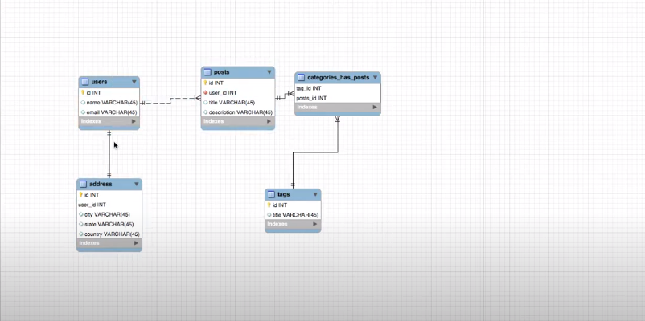

<p>***একটা ইউসার এর একটা এড্রেস থাকে এজন্য ইউসার এর সঙ্গে এড্রেস এর রিলেসন হচ্ছে ওয়ান টু ওয়ান***</p>
<p>***একটা ইউসার এর অনেকগুলো পোস্ট থাকে এজন্য ইউসার এর সঙ্গে পোস্ট  এর রিলেসন হচ্ছে ওয়ান টু মেনি ***</p>
<p>***একটা পোস্ট  এ অনেকগুলো ট্যাগ  থাকে এবং একটা ট্যাগ এ অনেকগুলো পোস্ট থাকে  এজন্য পোস্ট এর সাথে  ট্যাগ  এর রিলেসন হচ্ছে মেনি  টু মেনি  ***</p>

```php
User model:
Public function address(){
return $this->hasOne(Address::class);
}
```
<p>*** hasone দেওয়ার কারণ হচ্ছে একটা ইউসার এর একটায় এড্রেস থাকে এজন্য আমরা hasone ব্যবহার করছি 

এড্রেস  টেবিল এর সমস্ত ডাটাগুলো আমরা ইউসার টেবিল এর মডেল দিয়ে  এক্সেস করতে পারবো ***
 </p>

 ```php
$user=User:find(1);
Example:echo $user->name;

example2:$user->address->country

```
<p>*** আমরা এড্রেস টেবিল এর ডাটা গুলো সহজেই পেয়ে গেসি রিলেসন এর মাধ্যমে ***</p>
<p>****এখন আমরা চাচ্ছি  এড্রেস টেবিল থেকে ইউসার কে খুজে বের করতে আমার ইউসার আছে আমি এড্রেস চাচ্ছি  আমার এড্রেস আছে  আমি ইউসার চাচ্ছি এই ধরণের রিলেসন কে ইনভার্স রিলেসন বলে আর ইনভার্স রিলেসন এর  ক্ষেত্রে belong to হয়  *** </p>
<p>***বাপের অধীনে পুত্র থাকলে belongs to হবে ***</p>

```php
User model:
Public function address(){
return $this->hasOne(Address::class,'user_id','id');
}
```
<p>***একটা ইউসার এর একাদিক পোস্ট থাকে এজন্য ইউসার এর সাথে পোস্ট এর ওয়ান টু মেনি সম্পর্ক ***</p>

```php
User model:
Public function posts(){
return $this->hasmany(post::class,'user_id','id');
}
```
<p>***hasmany ডাটা বের করে দেখানোর সিস্টেম ***</p>

```php
$user=user::find(1);
@foreach ($user->posts as $post)
@endforeach
```
<p>**** একটা পোস্ট এর অনেকগুলো ট্যাগ থাকতে পারে  আবার একটা ট্যাগ এ অনেকগুলো পোস্ট থাকতে পারে এজন্য এদের সম্পর্ক হচ্ছে মেনি টু মেনি। মেনি টু মেনি। রিলেশন শিপ এর ক্ষেত্রে মাঝে একটা pivot টেবিল থাকে। ****</p>
<p>*** মেনি টু মেনি ডিক্লেয়ার করার সিস্টেম *** </p>

```php
 post model:
 public function tags(){
     return $this->belongToMany('Tag::class','post_tag','post_id','tag_id');
 }
```

<p>*** এখানে আমরা পোস্ট টেবিল এর মাধ্যমে ট্যাগ্স টেবিল গুলো এক্সেস করতে পারবো। প্রথম প্যারামিটা টা হচ্ছে ট্যাগ মডেল দ্বিতীয় টা হচ্ছে পিভট টেবিল যেখানে পোস্ট id এবং ট্যাগ id রাখা আছে। ***</p>


